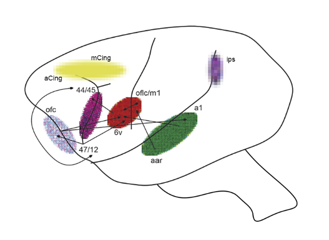

# Jenny Michlich's CV

## Jenny's biography

Jenny Michlich, AM, completed her undergraduate degrees in neuroscience and anthropology at the University of Pittsburgh, where she studied under Colin Allen, PhD, a philosopher of comparative animal cognition. She then went on to complete a master’s degree in human evolutionary biology at Harvard University under Erin Hecht, PhD, where her thesis focused on the effects of domestication on motor control for facial expression and vocalization in the Russian farm-foxes. Currently, she is completing a second master’s degree in complexity science at Arizona State University, where she is building a multidimensional network graph to understand the role of physiological signaling in vertebrate vocalization. She is also an adjunct instructor at Husson University and the Community College of Allegheny County in animal studies and the biological sciences, where she hopes to help students learn more about the complexity of biological life in all of its forms.

## Additional links
1. Orcid: https://orcid.org/0000-0002-4053-669X
2. Researchgate: https://www.researchgate.net/profile/Jenny-Michlich?ev=hdr_xprf

## Other works
1. Michlich, J. M. (2025). Immunohistochemistry protocol for visualization of the corticospinal, corticobulbar, corticorubral, and rubrospinal tracts.
2. Papadopoulos D, Andrews K, Michlich J. Removing the glass ceilings: diverse mechanisms for social cohesion. Behavioral and Brain Sciences. 2025;48:e179. doi:10.1017/S0140525X25100460
3. Rogers Flattery, C. N., Abdulla, M., Barton, S. A., Michlich, J. M., Trut, L. N., Kukekova, A. V., & Hecht, E. E. (2023). The brain of the silver fox (Vulpes vulpes): a neuroanatomical reference of cell-stained histological and MRI images. Brain Structure and Function, 228(5), 1177-1189.
4. Michlich, J. (2018). An analysis of semiotic and mimetic processes in Australopithecus afarensis. Public Journal of Semiotics, 8(2), 1-12.

# This repository contains the following items:

1. Current CV
2. LaTex code to produce CV
3. Copy of current teaching philosophy
4. Copy of master's thesis for the degree AM in Human Evolutionary Biology at Harvard University
5. One recent writing sample.
6. One example syllabus for a course designed and taught.
7. Alternative images for CV construction.
